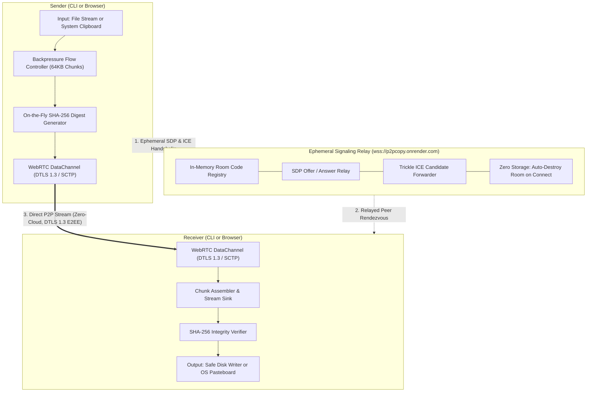
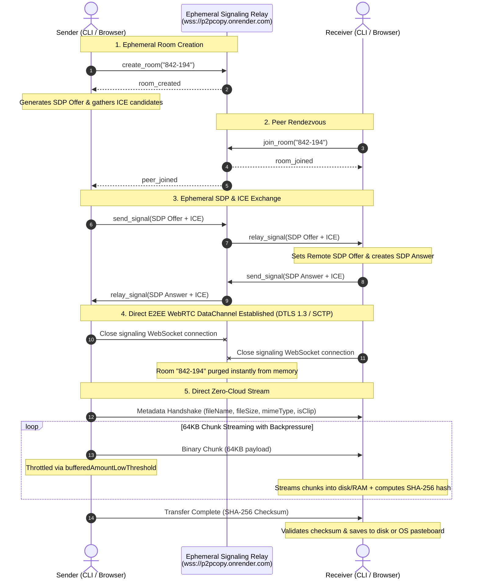

# 🚀 p2pcopy

> **Zero-cloud, end-to-end encrypted peer-to-peer file and clipboard sharing across developer terminals and web browsers.**

`p2pcopy` is a high-performance peer-to-peer transfer tool that streams files and clipboard payloads directly between any two devices over **WebRTC DataChannels**. There are **zero cloud storage buckets, no accounts, and no intermediate file uploads**. A short-lived, ephemeral signaling exchange connects both peers, after which data streams directly device-to-device with end-to-end DTLS 1.3 / SCTP encryption.

---

[](https://www.npmjs.com/package/p2pcopy)
[](https://p2pcopy.onrender.com)
[](https://opensource.org/licenses/MIT)

---

## ⚡ Key Highlights

- 🔒 **End-to-End Encrypted (E2EE):** Direct WebRTC DataChannels secured with DTLS 1.3. Payloads never touch third-party servers.
- 💨 **Zero Cloud Storage:** Data streams directly memory-to-memory / disk-to-disk between peers.
- 🌐 **Full Terminal ⇄ Web Interoperability:** Transfer seamlessly between terminal CLIs and modern web browsers in any combination.
- 📋 **Clipboard Beaming:** Beam tokens, SSH keys, passwords, or shell pipelines directly into a remote machine's pasteboard (`cat id_rsa.pub | p2pcopy clip`).
- 📦 **Chunked Streaming with Backpressure:** 64KB SCTP chunks with `bufferedAmountLow` flow control, transferring multi-gigabyte files using under 20MB of RAM.
- 🛡️ **SHA-256 Verified:** Automatic on-the-fly checksum computation and verification before files are saved.
- 🚪 **NAT & Firewall Resilience:** Built-in STUN hole-punching with configurable TURN blind relay fallback (`--ice`) for strict corporate firewalls.
- 📦 **Also a Typed Library:** Importable into Node.js and TypeScript backends for automated peer-to-peer streaming pipelines.

---

## 🌐 Live Web Application

Prefer the browser or sharing with someone on a phone or tablet? Open the live web app with **zero installation**:

👉 **[https://p2pcopy.onrender.com](https://p2pcopy.onrender.com)**

- **Send:** Drag & drop any file or paste text to generate a 6-digit code.
- **Receive:** Enter the 6-digit pairing code to download files or copy beamed clipboard text directly to your device.

---

## 🔄 4 Transfer Combinations

With dual CLI and in-browser capabilities, `p2pcopy` works across all four combinations:

| # | Combination | Flow | Real-World Use Case |
| :--- | :--- | :--- | :--- |
| **1** | **Terminal ➔ Terminal** | `p2pcopy send <file>` ➔ `p2pcopy receive <code>` | Machine-to-machine streaming between developer terminals. |
| **2** | **Terminal ➔ Browser** | `p2pcopy send <file>` ➔ Web tab | Beam files from a headless cloud server directly to a phone or laptop browser. |
| **3** | **Browser ➔ Terminal** | Web tab ➔ `p2pcopy receive <code>` | Teammate sends from their browser; you download straight into your terminal directory. |
| **4** | **Browser ➔ Browser** | Web tab ➔ Web tab | 100% zero-install, direct peer-to-peer web transfers between any two browser tabs or mobile devices. |

---

## 🏗️ Architecture & Protocol Flow

`p2pcopy` combines a lightweight, ephemeral signaling relay with direct peer-to-peer WebRTC DataChannels. **Payloads never touch any intermediate server** — neither the signaling server nor any cloud bucket ever sees your files or clipboard data.

### System Topology



### Protocol Sequence Diagram



### Core Engineering Principles

1. **Zero Cloud Storage & Zero Knowledge:**  
   No S3 buckets, no blob storage, no accounts. The signaling server is an in-memory WebSocket broker that exists solely to exchange SDP strings and ICE candidates. Once the WebRTC DataChannel is negotiated, both peers detach from signaling, and the room is immediately purged from RAM.
2. **Cross-Platform Interoperability:**  
   Node.js CLI endpoints utilize native C++ WebRTC bindings (`node-datachannel`), while web endpoints use standard W3C browser `RTCPeerConnection` APIs. Both compile down to identical DTLS 1.3 / SCTP wire formats, enabling seamless transfers across any combination of terminal and browser.
3. **Constant-Memory Streaming with Backpressure:**  
   Files are read as continuous Node.js / Web Streams divided into 64KB binary chunks. Senders monitor `dataChannel.bufferedAmount` with a low-water mark (`bufferedAmountLowThreshold = 64KB`), pausing disk reads when network buffers fill. This allows transferring multi-gigabyte files using under 20MB of RAM without buffer overflow or packet drops.
4. **Cryptographic Checksum Verification:**  
   As chunks stream across the wire, both sender and receiver update an incremental SHA-256 cryptographic digest. Before the receiver writes the final file to disk, the calculated checksum is verified against the sender's digest to guarantee zero bit rot or tampering.

---

## 📥 Quickstart (Zero Installation Required!)

Anyone with Node.js 18+ can run `p2pcopy` on-demand via `npx`:

```bash
# Send a file:
npx p2pcopy send ./archive.tar.gz

# Receive a file on another machine:
npx p2pcopy receive 842-194
```

### Global Installation (Optional for Frequent Use)

```bash
npm install -g p2pcopy
```

Once installed globally, run `p2pcopy` directly from anywhere in your shell:
```bash
p2pcopy send ./archive.tar.gz
p2pcopy receive 842-194
```

---

## 🧭 Six Commands, Zero Config

### 1. `send <file>` — File Sender
Stream any file or archive directly to a peer with real-time speed, progress bar, backpressure control, and SHA-256 verification.
```bash
p2pcopy send dataset.csv
# or with custom signaling relay:
p2pcopy send dataset.csv --signal wss://your-relay.com
```

### 2. `receive <code>` — File Receiver
Connect via 6-digit pairing code and download the incoming file directly into your local directory.
```bash
p2pcopy receive 842-194

# Save to a specific folder:
p2pcopy receive 842-194 --output ~/Downloads
```

### 3. `clip [send]` — Clipboard Beam (or Stdin Pipe)
Share your current system pasteboard or pipe text/tokens from terminal without creating temporary files on disk.
```bash
# Share current system clipboard:
p2pcopy clip

# Or pipe output directly from shell pipelines:
cat ~/.ssh/id_rsa.pub | p2pcopy clip
git diff | p2pcopy clip
```

### 4. `clip get <code>` — Clipboard Receiver (or Stdout Pipe)
Receive beamed clipboard text directly into your system pasteboard, or stream to stdout for Unix pipeline chaining.
```bash
# Automatically write to system clipboard:
p2pcopy clip get 842-194

# Or pipe directly to terminal / tools without altering pasteboard:
p2pcopy clip get 842-194 --no-copy | jq .
```

### 5. `signal` — Self-Host Ephemeral Relay
Host a lightweight, zero-storage WebSocket signaling relay on your own VPS, server, or private air-gapped network:
```bash
p2pcopy signal --port 9000
```
> **Privacy Guarantee:** The signaling server never sees files, clipboard content, or encryption keys. It only relays ephemeral WebRTC handshake messages and immediately drops the room once connected.

### 6. `--ice <urls...>` — NAT & Firewall Traversal
Flag that can be attached to any command to traverse strict corporate symmetric NATs, university firewalls, or cellular CGNATs via custom STUN or TURN relays:
```bash
p2pcopy send data.zip --ice turn:username:password@turn.example.com:3478
# Or via environment variable:
export P2PCOPY_ICE="turn:username:password@turn.example.com:3478"
```

---

## 📦 Programmatic Library API

`p2pcopy` exports its core modules so you can build peer-to-peer streaming directly into your own Node.js / TypeScript applications:

```typescript
import {
  WebRTCPeer,
  SignalingClient,
  FileSender,
  FileReceiver,
  readClipboard,
  writeClipboard,
  EphemeralSignalingServer,
} from "p2pcopy";

// 1. Connect to signaling relay
const signal = new SignalingClient("wss://p2pcopy.onrender.com");
await signal.connect();
await signal.createRoom("842-194");

// 2. Initialize WebRTC peer
const peer = new WebRTCPeer({
  name: "sender",
  isInitiator: true,
  roomId: "842-194",
  signalingClient: signal,
});
await peer.start();

// 3. Stream file directly when connected
peer.on("connected", async (dataChannel) => {
  const sender = new FileSender({
    filePath: "./dataset.tar.gz",
    dataChannel,
    showProgress: true,
  });
  await sender.send();
});
```

---

## 🔬 Systems Insight: NAT Traversal & Reliability

```
[Tier 1: Direct LAN / UPnP]
          │ (Zero NAT, Maximum Speed)
          ▼
[Tier 2: STUN Hole-Punching]
          │ (Succeeds on ~85-90% of home & office NATs)
          ▼
[Tier 3: Encrypted TURN Blind Relay]
            (Guaranteed delivery for Symmetric NATs, CGNAT, & strict enterprise firewalls)
```

1. **Direct STUN (Default):** Discovers public IP/port endpoints and establishes direct UDP connections across most consumer routers.
2. **Symmetric NAT & CGNAT:** Standard on cellular 4G/5G networks and enterprise corporate firewalls.
3. **TURN Blind Relay:** In environments where symmetric NATs prevent direct UDP hole punching, pass a TURN server with `--ice`. Crucially, TURN relays only forward encrypted DTLS frames — no payload data is readable by the relay.

---

## 🧪 Running Tests

The test suite exercises signaling, WebRTC negotiation, chunked streaming with backpressure, and clipboard synchronization:

```bash
npm test
```

Included test suites:
- `test/signaling.test.js`: WebSocket signaling relay lifecycle and room teardown.
- `test/webrtc.test.js`: WebRTC DataChannel connection negotiation and bidirectional messaging.
- `test/file-transfer.test.js`: Binary stream chunking, backpressure control, and SHA-256 digest validation.
- `test/clipboard.test.js`: Cross-machine clipboard synchronization and system pasteboard integration.

---

## 📄 License

MIT © 2026 Krishnanand Tiwari