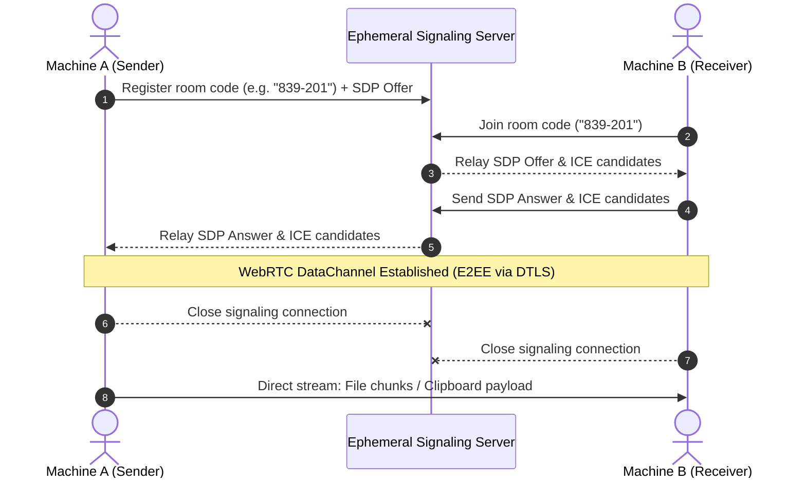

# 🚀 p2pcopy

> **Zero-cloud, end-to-end encrypted peer-to-peer file and clipboard sharing right from your terminal.**

`p2pcopy` is a lightweight CLI tool that allows two computers to transfer files and clipboard content directly over WebRTC DataChannels. There are **no cloud storage buckets, no accounts, and no intermediate file uploads**. A short-lived signaling exchange connects both peers, after which data streams directly device-to-device with end-to-end encryption.

---

## ✨ Features

- ⚡ **Direct Peer-to-Peer:** Data flows directly between sender and receiver via WebRTC DataChannels (SCTP over DTLS).
- 🔒 **End-to-End Encrypted:** WebRTC enforces DTLS encryption by default. No plain-text payload ever touches third-party infrastructure.
- 💨 **Ephemeral Signaling:** A tiny, short-lived rendezvous server is used solely for the initial SDP/ICE handshake. Once connected, signaling is terminated.
- 📋 **Clipboard Syncing:** Easily beam clipboard snippets, tokens, and text buffers across machines with a single command.
- 📦 **File & Directory Streaming:** Chunked streaming transfer with integrity checks and real-time progress indicators.
- 🌐 **Browser Counterpart Ready:** Designed with a protocol schema compatible with browser-based WebRTC clients.

---

## 🛠️ Architecture & Flow



---

## 🧭 Planned CLI Interface

### File Transfer
```bash
# Sender generates a 6-digit code or phrase
p2pcopy send ./project.zip

# Receiver fetches directly from peer
p2pcopy receive 839-201
```

### Clipboard Transfer
```bash
# Pipe text or copy current clipboard to peer
cat id_rsa.pub | p2pcopy clip
# or
p2pcopy clip send

# Receiver pastes into local clipboard or stdout
p2pcopy clip get
```

---

## 🔬 Systems Insight: Pure P2P vs. Real-World Reliability

While `p2pcopy` prioritizes the **zero-cloud storage** and **privacy** principle, real-world networking at scale introduces edge cases:

```
[Tier 1: Direct LAN / UPnP]
          │ (Fastest, zero NAT)
          ▼
[Tier 2: STUN Hole-Punching]
          │ (Handles ~80-85% of home & office NATs)
          ▼
[Tier 3: Encrypted TURN Blind Relay]
            (Guaranteed delivery for Symmetric NATs, CGNAT, & strict enterprise firewalls)
```

### The NAT Traversal Limitation
* **STUN** allows peers to discover their public-facing IP and port. This succeeds on Full-Cone and Restricted-Cone NATs (~80-85% of standard internet connections).
* **Symmetric NAT & Carrier-Grade NAT (CGNAT):** Standard on 4G/5G mobile carriers and enterprise firewalls. A new external port is mapped for each remote destination, making direct hole-punching mathematically impossible without port prediction.

### Production Roadmap: TURN Relay Fallback
In production environments, resilience is achieved by quietly falling back to a **blind TURN relay** (e.g. via Coturn or DERP-style relays) if ICE candidate gathering fails:
- The relay acts solely as a blind packet forwarder.
- It sees only encrypted DTLS/SCTP frames.
- **Zero-knowledge privacy is 100% preserved** while guaranteeing a 100% connection success rate.

Users will be able to supply custom STUN/TURN servers via `--ice-servers` or the `P2PCOPY_ICE` environment variable.

---

## 📄 License
MIT
